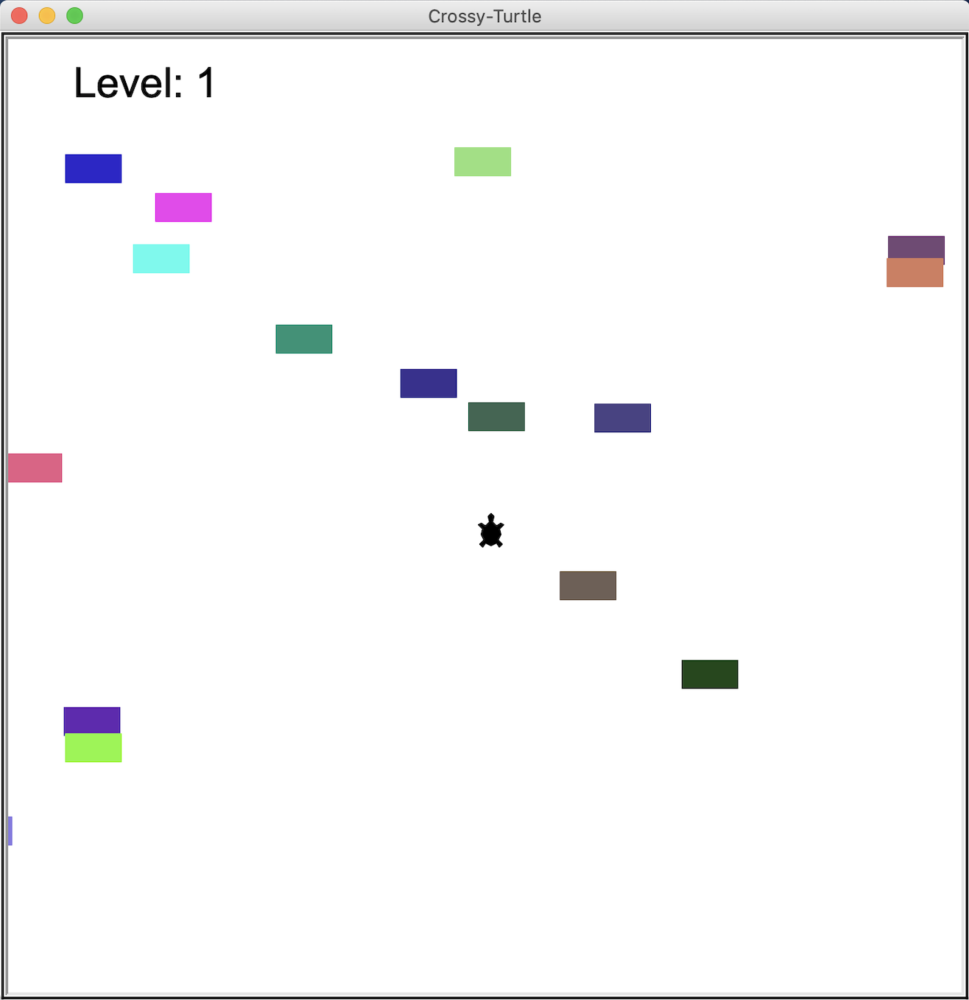
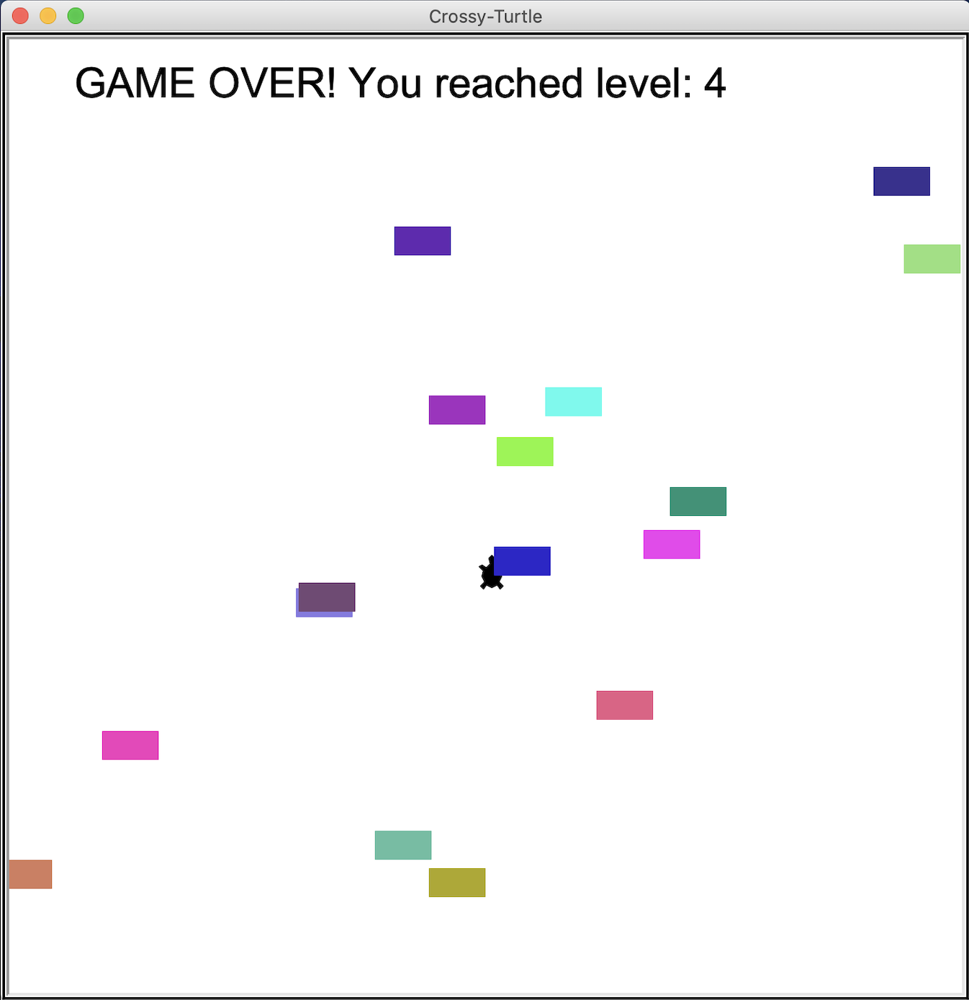

# crossy_turtle :turtle: 

This project is a recreation of the popular mobile game "Crossy-Road"

The turtle is controlled only by the space key and can only move in one direction. The cars pass from right to left and can hit the turtle. 
The goal of the game is to manage to cross the road to the next level as many times as possible without getting hit by a car. 
Watch out, the cars go faster and faster! :car:

Enjoy the game! 

​

​
